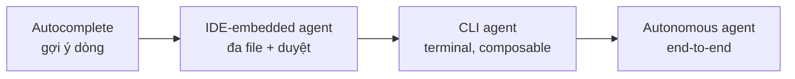

# Hướng dẫn Agentic Coding: Từ "Vibe" đến Điều phối hiệu quả

> **Dành cho ai:** lập trình viên đã dùng Claude Code / Cursor (hoặc một AI coding agent nào đó) và muốn **nâng cao** — không phải để gõ prompt nhanh hơn, mà để dùng agent một cách có **hiệu quả và năng suất đo được**.
>
> **Tài liệu này KHÔNG làm gì:** không dạy lập trình cơ bản, không phải hướng dẫn cài đặt từng OS, không tô hồng. Mọi con số quan trọng đều có dẫn nguồn (xem [Nguồn tham khảo](#nguồn-tham-khảo)). Khi bằng chứng nói ngược với hype, tài liệu đứng về phía bằng chứng.

**Luận điểm xuyên suốt:** Công cụ chỉ là phương tiện. Cái quyết định năng suất không phải là *bạn để agent tự chủ tới đâu*, mà là *bạn chọn đúng mức tự chủ cho từng việc và đặt đủ guardrail*. Tài liệu đi theo mạch: bối cảnh → triết lý → công cụ → tự định vị trên thang level → thực hành với `oh-my-claudecode`.

---

## Phần 1 — Bối cảnh: autocomplete → vibe coding → agentic coding

### 1.1. Một dòng thời gian ngắn

Agentic coding không rơi từ trên trời xuống. Nó là điểm cuối (tạm thời) của một đường tiến hóa kéo dài 5 năm:

| Mốc | Sự kiện | Ý nghĩa |
|-----|---------|---------|
| 06/2021 | GitHub Copilot technical preview (OpenAI Codex) | Kỷ nguyên **autocomplete**: gợi ý từng dòng, người vẫn là tác giả |
| 11/2022 | ChatGPT ra mắt (1M user trong 5 ngày) | Code-qua-hội-thoại phổ cập |
| 03/2023 | Claude 1 (Anthropic) | Cuộc đua model lý luận |
| 03/2024 | Devin 1.0 (Cognition) tự nhận "AI Software Engineer đầu tiên" | Khái niệm **agent tự chủ end-to-end** xuất hiện |
| 10/2024 | Claude Code research preview | Agent **terminal-native** |
| **02/02/2025** | Andrej Karpathy đặt ra thuật ngữ **"vibe coding"** | Đặt tên cho một phong cách làm việc mới |
| 09/2025 | Claude Code 2.0 + VS Code extension | Agentic coding thành dòng chính |
| 2026 | Karpathy retrospective, đề xuất thuật ngữ "agentic engineering" | Ngành bắt đầu phân biệt "vibe" (chơi) với "engineering" (làm thật) |

Nguồn: [GitHub Copilot history (Wikipedia)][copilot], [Anthropic model timeline][anthropic-timeline], [Devin][devin-tml].

### 1.2. "Vibe coding" thực ra là gì

Ngày 2/2/2025, Karpathy (đồng sáng lập OpenAI, cựu Director AI của Tesla) đăng một tweet — chính ông sau này gọi là *"throwaway tweet"* — định nghĩa:

> *"There's a new kind of coding I call vibe coding, where you fully give in to the vibes, embrace exponentials, and forget that the code even exists."* — [Karpathy, 2/2/2025][karpathy]

Tweet đó (4.5 triệu lượt xem) mô tả 4 hành vi cốt lõi của vibe coding:

1. **Accept toàn bộ** code AI sinh ra mà không đọc diff.
2. **Paste thẳng error** trả lại cho AI để nó tự sửa.
3. Để codebase **phình to vượt ngoài tầm hiểu** của chính mình.
4. Dùng **voice input** (Karpathy dùng SuperWhisper) thay vì gõ.

"I just see stuff, say stuff, run stuff, and copy-paste stuff, and it mostly works." Đến cuối 2025, Collins Dictionary chọn **"vibe coding" là Word of the Year**. ([Collins][collins])

**Điểm cần thẳng thắn:** ngay trong tweet gốc, Karpathy đã ghi rõ đây là phong cách cho **dự án cuối tuần / hobby**, nơi "code mostly works" là đủ. Nó **không phải** quy trình kỹ thuật cho production. Việc đánh đồng "vibe coding" với "cách làm phần mềm nghiêm túc" là nguồn gốc của phần lớn hype lẫn thất vọng sau này.

### 1.3. Vibe coding khác autocomplete ở chỗ nào — và "agentic coding" sinh ra thế nào

Autocomplete thời Copilot (2021–2022): agent **gợi ý**, bạn **đọc – hiểu – chọn** từng đoạn. Bạn vẫn là *author*.

Vibe coding phá vỡ cả ba quy ước đó: không đọc diff, không cần hiểu, không giữ authorship — bạn *"steer"* bằng ngôn ngữ tự nhiên và chấp nhận output.

"Agentic coding" là bước trưởng thành tiếp theo: giữ lại sức mạnh ủy thác của vibe coding, nhưng **gắn lại kỷ luật kỹ thuật** (review, test, spec). Báo cáo *Anthropic 2026 Agentic Coding Trends* mô tả ngắn gọn sự dịch chuyển:

> *"In 2024, most AI coding assistance was inline autocomplete. By 2026, the dominant pattern is autonomous execution — the developer describes a task and the agent executes it across multiple files, running commands and iterating until the task is complete."* ([Anthropic][anthropic-trends])

Tóm lại: **code suggestion → steerable draft → intent delegation**.

### 1.4. Bản đồ thị trường (landscape) — 4 nhóm kiến trúc

Hàng chục công cụ, nhưng chúng xếp vào 4 nhóm theo **mức tự chủ tăng dần** ([Swarmia][swarmia], [Prommer][prommer]):



- **Autocomplete:** GitHub Copilot (bản gốc), Codeium.
- **IDE-embedded agent:** Cursor, Windsurf, Cline, Continue.
- **CLI agent:** **Claude Code**, Aider, OpenHands (CLI mode).
- **Autonomous agent:** Devin, OpenHands (full).

Ranh giới đang mờ dần — Copilot nay đã có cả "coding agent" chạy trên cloud. Điều đáng nhớ: **vị trí của một công cụ trên trục này là một lựa chọn triết học**, không phải thước đo "xịn hơn". Phần 2 sẽ mổ xẻ.

---

## Phần 2 — Triết lý: công cụ chỉ là phương tiện

### 2.1. Vì sao triết lý quan trọng hơn tính năng

Mọi công cụ ở Phần 1 đều gọi cùng những model (Claude, GPT, Gemini). Thứ phân biệt chúng — và phân biệt một dev hiệu quả với một dev "vibe" — là **triết lý sử dụng**: bạn đặt ranh giới quyền lực cho agent ở đâu, và bạn giữ vai trò gì.

Triết lý cô đọng nhất, mượn từ `oh-my-claudecode`:

> **Bạn là nhạc trưởng, không phải nhạc công.** (*You are the conductor, not the performer.*)

Nhạc trưởng không chơi từng nốt. Họ **định hướng, phân vai, và kiểm tra**. Khi bạn nhảy vào tự sửa từng dòng, bạn vừa làm chậm chính mình vừa đánh mất bức tranh tổng thể. Khi bạn buông hoàn toàn (vibe coding thuần), bạn mất kiểm soát chất lượng. Hiệu quả nằm ở khoảng giữa — và biết *mình đang ở đâu trong khoảng giữa đó* chính là nội dung Phần 4.

### 2.2. Cùng một model, những triết lý đối nghịch

Đọc triết lý thiết kế của vài công cụ là cách nhanh nhất để thấy "trục control ↔ autonomy" là một *lựa chọn có chủ đích*:

| Công cụ | Triết lý cốt lõi | Hệ quả thiết kế |
|---------|------------------|-----------------|
| **Claude Code** | *"Do the simple thing first."* Vòng lặp đơn luồng (codename nội bộ **"nO"**), **chủ đích tránh** multi-agent swarm | Ưu tiên debuggability & minh bạch; composable kiểu Unix (pipe, CI/CD). Dev định nghĩa goal, review kết quả ([ZenML][zenml], [Anthropic][cc-product]) |
| **Aider** | *Git là source of truth & cơ chế an toàn* | Mỗi edit = 1 atomic commit có message do LLM viết; tách Architect/Editor để rẻ hơn ([Aider][aider]) |
| **Cline** | *"Inference không nên là business model"* → approval-first | Người duyệt từng action; mã nguồn mở, minh bạch chi phí ([Cline][cline]) |
| **OpenHands** | *"Agentic tech quá quan trọng để vài công ty kiểm soát"* | Mã nguồn mở (ICLR 2025), kiến trúc CodeAct, ~77% SWE-Bench Verified, model-agnostic ([OpenHands][openhands]) |
| **Devin** (Cognition) | *Autonomous software engineer* | End-to-end, ít can thiệp; đã mua Windsurf → Devin Desktop ([Devin][devin-desktop]) |
| **Cursor** | *Developer-as-orchestrator* | IDE-native, Cursor 3 agent-first ([InfoQ][infoq-cursor]) |

Bài học: **không có công cụ "đúng" tuyệt đối**. Có công cụ phù hợp với mức tự chủ mà *task của bạn* cho phép. Một thư viện nội bộ chưa có test thì approval-first (Cline/Claude Code supervised) an toàn hơn full-autopilot (Devin) — bất kể model mạnh tới đâu.

> ⚠️ **Bẫy đặt tên:** Codeium (→ Windsurf → Devin Desktop) và CodiumAI (→ Qodo) là **hai công ty khác nhau**. Codeium thiên về tăng tốc code; Qodo thiên về code integrity/testing. Tài liệu khắp nơi nhầm hai cái này.

---

## Phần 3 — Công cụ: `oh-my-claudecode` (trọng tâm) và `oh-my-pi` (sơ lược)

### 3.1. Nền móng: Claude Code

Claude Code là một **CLI agent terminal-native** của Anthropic (preview 10/2024, GA dần qua 2025). Triết lý "do the simple thing first": một vòng lặp đơn luồng đọc → sửa → chạy → tự kiểm, bạn duyệt kết quả. Mạnh, minh bạch, nhưng *trần năng suất* nằm ở chỗ nó là **một** agent.

### 3.2. `oh-my-claudecode` (OMC) — biến Claude Code thành dàn nhạc

`oh-my-claudecode` là một **lớp điều phối đa-agent** (multi-agent orchestration) chồng lên Claude Code. Thay vì một agent, bạn chỉ huy một dàn agent chuyên biệt. Theo [docs OMC][omc-docs], OMC cung cấp:

- **19 agent chuyên biệt** chia 3 lane (Build & Analysis, Review, Domain Specialists), mỗi agent gắn model phù hợp (Opus/Sonnet/Haiku).
- **10 execution mode** — từ Autopilot (tự chủ toàn phần) tới Team (điều phối native) và Ralph (kiên trì).
- **25+ MCP tool** — Language Server, AST grep, Python REPL, và model ngoài (Codex, Gemini).
- **Native Teams** — pipeline phân tầng `plan → prd → exec → verify → fix`.

Nguyên tắc vàng của OMC nhắc lại đúng triết lý Phần 2:

> **Golden Rule:** *NEVER make code changes directly. ALWAYS delegate to specialized agents.* Vai trò của bạn là **guide, review, orchestrate**.

Đây là lý do tài liệu này lấy OMC làm trọng tâm: nó **mã hóa triết lý conductor thành công cụ**, và **dễ bắt đầu** — bạn gõ ý định bằng ngôn ngữ tự nhiên ("autopilot build...", "ralph refactor..."), OMC tự định tuyến. Cách dùng cụ thể ở Phần 5.

### 3.3. `oh-my-pi` (giới thiệu sơ)

`oh-my-pi` là một **harness agentic coding** khác (chính harness đang chạy phiên này). Cùng họ triết lý *delegation-first* với OMC, nhưng nhấn vào **bộ công cụ tích hợp giàu** và **song song hóa**: tìm/sửa code theo cấu trúc (AST), LSP code-intelligence, kernel `eval` bền trạng thái, browser automation, `task` subagent chạy song song, và kênh nhắn tin giữa các agent (IRC-style).

Điểm chung quan trọng với OMC: cả hai đều coi *con người là nhạc trưởng* và *agent chuyên biệt là nhạc công*. Tài liệu này không đi sâu `oh-my-pi` — nếu bạn mới bắt đầu, **OMC dễ tiếp cận hơn**; coi `oh-my-pi` như một điểm khác trong cùng không gian thiết kế để biết rằng triết lý điều phối không phụ thuộc một sản phẩm cụ thể.

---

## Phần 4 — Hệ thống level: bạn đang ở đâu? (trục tự chủ)

Đây là xương sống của tài liệu. Mục tiêu: cho bạn một thước đo **khách quan** để tự định vị — và một thông điệp chống hype.

### 4.1. Vì sao đo theo "mức tự chủ của agent" (autonomy)

Trục autonomy không phải tôi tự nghĩ ra. Nó là cách **ngành đang hội tụ**. Tương tự thang **SAE J3016** (6 cấp tự lái L0–L5 cho xe), nhiều khung độc lập đã áp ngôn ngữ "levels of autonomy" cho AI coding:

| Khung | Trục | Các bậc |
|-------|------|---------|
| **Swarmia** (coding-specific, 2026) | agent làm bao nhiêu trước khi quay lại xin feedback | Assistive → Conversational → Task agent → Autonomous teammate → Agentic avalanche ([Swarmia][swarmia]) |
| **CSA** (Jim Reavis, 2026) | mức human control còn lại | L0 No → L1 Assisted → L2 Supervised → L3 Conditional → L4 High → L5 Full ([CSA][csa]) |
| **Knight First Amendment** (2025) | vai trò của người dùng | Operator → Collaborator → Consultant → Approver → Observer ([arXiv 2506.12469][knight]) |
| **ELEKS** (2026) | độ trưởng thành tổ chức | Traditional → AI-Supported → AI-Assisted → AI-Native → AI-Autonomous ([ELEKS][eleks]) |

**Đồng thuận giữa các khung:** (1) khoảng **5–6 bậc**; (2) cực thấp = AI chỉ gợi ý, người làm; (3) cực cao = full autonomy vẫn còn rủi ro/lý thuyết ("not appropriate for enterprise today" — CSA); (4) **human oversight nghịch chiều với autonomy**; và quan trọng nhất — (5) **cao hơn KHÔNG đồng nghĩa tốt hơn**. Autonomy là một *design choice*, không phải bậc thang để leo.

### 4.2. Thang 6 bậc (tổng hợp) + vị trí các công cụ

Thang dưới đây hợp nhất các khung trên (Swarmia cho mô tả coding, CSA cho mức kiểm soát, Knight cho vai trò người), gắn mỗi bậc với **một metric đáng tin** để đo (xem 4.3):

| Bậc | Agent làm gì | Vai trò bạn | Công cụ tiêu biểu | Metric phải canh |
|----|-------------|-------------|-------------------|------------------|
| **L0 Manual** | Không AI | Author | — | (baseline) |
| **L1 Assistive** | Autocomplete từng dòng | Operator | Copilot inline | Code churn |
| **L2 Conversational** | Chat, sửa đa file, **bạn duyệt từng bước** | Collaborator | Claude Code cơ bản, Cursor chat | Review từng diff |
| **L3 Delegation (Conductor)** | Nhận task → tự plan → sửa nhiều file → mở PR; **bạn duyệt kết quả, không duyệt từng bước** | Approver | Claude Code agentic + **OMC cơ bản**, Copilot coding agent | Change Failure Rate, defect escape |
| **L4 Orchestration** | **Nhiều agent song song** + quality gate (plan/exec/verify) | Designer/Approver | **OMC Autopilot / Team / Ralph**, oh-my-pi | Churn, stability, lead time |
| **L5 Autonomous** | Tự chọn task từ backlog, self-improving loop | Observer | Frontier (Devin, multi-agent) — *rủi ro* | "not enterprise-ready" |

**Dấu hiệu bạn đang ở bậc nào (tự định vị nhanh):**
- Bạn đọc và sửa tay phần lớn code AS sinh → **L1–L2**.
- Bạn giao một task rõ ràng và review PR agent mở ra → **L3**.
- Bạn thiết kế pipeline nhiều agent (planner → executor → verifier) và chỉ duyệt cổng chất lượng → **L4**.
- Bạn để agent tự chọn việc làm → **L5** (và bạn nên có lý do rất tốt + guardrail rất chặt).

### 4.3. Thông điệp chống hype: chọn ĐÚNG bậc, không leo tối đa

Đây là phần dễ bị bán hype nhất, nên nó cần bằng chứng cứng. **Tự chủ cao hơn không tự động cho năng suất cao hơn.** Bằng chứng:

- **METR RCT 2025:** đo 16 dev open-source giàu kinh nghiệm trên 246 task ở repo họ thông thạo. Khi *được phép* dùng AI, họ **chậm hơn 19%** (CI 95% [+2%, +39%]). Đáng sợ hơn: họ *tự nghĩ* mình nhanh hơn 24% — khoảng cách nhận thức ~43 điểm phần trăm. ([METR][metr], [arXiv 2507.09089][metr-arxiv])
- **DORA 2025** (~5.000 người): AI là **chất khuếch đại** — throughput tăng nhưng **stability giảm** nếu thiếu automated testing. "AI không sửa được team yếu, nó phóng đại điều kiện sẵn có." Chỉ 24% "tin tưởng nhiều" vào AI. ([DORA][dora])
- **GitClear** (211 triệu dòng code): code churn tăng **3.1% → 5.7%**, copy-paste **8.3% → 12.3%**, refactoring **25% → <10%** — lần đầu tiên code copy-paste vượt code refactored. ([GitClear][gitclear])
- **Bảo mật:** code do AI sinh có **mật độ lỗ hổng cao hơn ~2.7×**; 30–62% chứa lỗ hổng tùy phương pháp đo. ([arXiv 2404.18353][sec-arxiv], [Veracode][veracode])
- **Stack Overflow 2025:** adoption tăng 76% → 84% nhưng **trust giảm 40% → 29%**; 45% bực nhất vì code "almost right but not quite"; 66% tốn thêm thời gian debug code AI. ([SO Survey][so])

Mặt khác, AI *có* hiệu quả khi đặt đúng chỗ: Copilot trong lab giúp nhanh hơn 55.8% trên **task đơn giản** (nhưng giảm còn ~42% ở môi trường thật, [Peng 2023][copilot-study]); junior hưởng lợi +21–52% còn senior chỉ +7–16%, và **task càng phức tạp lợi ích càng tiệm cận <10%** ([McKinsey][mckinsey]).

**Kết luận thực dụng:** mỗi bậc autonomy là một công cụ. L4 orchestration rực rỡ cho việc *song song, lặp lại, có test bao quanh*. L2 supervised là đúng cho code *nhạy cảm, ít test, một-lần*. Leo lên L4/L5 mà thiếu guardrail = đúng công thức tạo ra churn và lỗ hổng mà các nghiên cứu trên đo được.

### 4.4. Đo "năng suất" bằng metric nào (để không tự lừa mình)

Tránh các metric dễ-hype: *số dòng sinh ra*, *tốc độ gõ*, *cảm giác nhanh*. Dùng metric hệ thống (DORA/SPACE):

| Metric | Đo cái gì | Vì sao đáng tin |
|--------|-----------|-----------------|
| **Code churn rate** (% code bị sửa < 2 tuần) | rework thực | AI làm tăng metric này — cờ đỏ sớm |
| **Change Failure Rate** | % thay đổi gây sự cố | đo chất lượng downstream sau deploy |
| **Lead time for changes** (commit → production) | tốc độ *cả hệ thống* | không chỉ tốc độ gõ |
| **Defect escape rate** | lỗi lọt tới user | chất lượng thật |
| **Security vuln density** | lỗ hổng/đơn vị code | bắt được rủi ro AI khuếch đại |

**Guardrail = điều kiện để lên bậc.** Bạn chỉ nên leo từ L_n lên L_{n+1} khi đã có: test tự động bao quanh vùng agent đụng tới, quy trình review (dù chỉ review kết quả), và spec/acceptance rõ. Thiếu guardrail thì bậc cao hơn chỉ phóng đại rủi ro — đúng như DORA và GitClear chứng minh.

---

## Phần 5 — Thực hành: dùng `oh-my-claudecode` hiệu quả

Phần này chuyển triết lý + thang level thành thao tác. Mọi lệnh dựa trên [docs OMC chính thức][omc-docs].

### 5.1. Cài đặt nhanh

```bash
# Trong Claude Code:
/plugin marketplace add https://github.com/Yeachan-Heo/oh-my-claudecode
/plugin install oh-my-claudecode
/oh-my-claudecode:omc-setup        # wizard cấu hình

# Hoặc dùng CLI:
npm install -g oh-my-claude-sisyphus
omc                                 # tự mở Claude Code trong tmux
```
> Cài đặt chi tiết theo từng OS: xem docs OMC. Tài liệu này chỉ cần bạn chạy được `omc`.

### 5.2. "Magic keywords" — gõ ý định, OMC tự định tuyến

OMC phát hiện ý định từ ngôn ngữ tự nhiên. Bạn không cần nhớ cú pháp; bạn mô tả việc:

| Gõ thế này | OMC làm gì | Bậc autonomy |
|------------|-----------|--------------|
| `/deep-interview 'ý tưởng còn mơ hồ'` | Phỏng vấn Socratic làm rõ yêu cầu trước khi code | (chuẩn bị) |
| `plan the auth system` | Mở phiên planning tương tác | L3 |
| `autopilot build a React dashboard` | Tự chủ toàn phần: idea → code | L4 |
| `ralph refactor the API` | Kiên trì tới khi verify sạch ("the boulder never stops") | L4 |
| `ulw fix all typescript errors` | Ultrawork: nhiều agent song song | L4 |
| `team 5:executor refactor backend` | Dàn 5 agent có lead điều phối | L4 |
| `ask codex to review this` | Hỏi model ngoài (Codex/Gemini) | L3 |

### 5.3. Bốn execution mode chính — khi nào dùng cái nào

Đây là khác biệt thực hành quan trọng nhất. Map thẳng vào thang level Phần 4:

**🤖 Autopilot** — tự chủ toàn phần, vòng lặp tự sửa.
```
autopilot build a login page with JWT auth
```
- Pipeline: Expansion (Analyst+Architect) → Planning (Architect+Critic) → Execution (Ralph+Ultrawork) → QA (UltraQA).
- **Dùng khi:** task rõ, có thể verify tự động, bạn muốn giao trọn. **Tránh khi:** vùng code nhạy cảm thiếu test.

**🔄 Ralph** — kiên trì tới khi đạt.
```
ralph refactor the API until all tests pass
```
- Vòng lặp vô hạn, tự bao gồm Ultrawork, yêu cầu verify mạnh: Architect xác nhận mới dừng.
- **Dùng khi:** mục tiêu có tiêu chí "đạt" rõ ràng (test xanh, lint sạch).

**⚡ Ultrawork (ulw)** — song song tối đa.
```
ulw fix these 5 bugs
```
- Tới 5+ agent nền chạy đồng thời, smart model routing, non-blocking.
- **Dùng khi:** nhiều việc *độc lập* (lý tưởng cho fan-out).

**👥 Team** — điều phối native nhiều agent.
```
team 3:executor build the dashboard
```
- Pipeline phân tầng có cổng chất lượng: `team-plan → team-prd → team-exec → team-verify → team-fix`.
- **Dùng khi:** spec lớn, cần phân rã + cổng kiểm soát.

> **Quy tắc chọn mode theo bậc:** việc một-phát rõ ràng → **L3** (`plan` rồi để executor làm). Việc lặp + verify được → **Ralph/Autopilot (L4)**. Nhiều việc độc lập → **Ultrawork (L4)**. Spec lớn nhiều giai đoạn → **Team (L4)**. Yêu cầu còn mơ hồ → **`deep-interview` trước** (đừng để agent đoán).

### 5.4. Model routing — đừng đốt Opus cho việc của Haiku

OMC định tuyến theo độ phức tạp; bạn nên hiểu để không lãng phí:

| Độ phức tạp | Model | Dùng cho |
|-------------|-------|----------|
| Simple | **Haiku** | tra cứu, đếm, format, doc đơn giản |
| Standard | **Sonnet** | implement, test, refactor |
| Complex | **Opus** | kiến trúc, debug sâu, planning |

19 agent (explore=Haiku, executor=Sonnet, architect/planner/critic=Opus, ...) đã gắn sẵn tier hợp lý.

### 5.5. Quy trình "nhạc trưởng" mẫu (gắn guardrail)

Một vòng làm việc L3–L4 lành mạnh, tôn trọng bằng chứng Phần 4:

1. **Làm rõ trước khi code:** yêu cầu mơ hồ → `/deep-interview`. (Spec tốt là chống-rework rẻ nhất — đúng tinh thần METR.)
2. **Plan:** `plan ...` để Architect dựng kế hoạch; bạn review *kế hoạch*, không review từng dòng.
3. **Phân vai & thực thi:** `autopilot` / `team` / `ulw` tùy hình dạng việc.
4. **Tách viết và kiểm:** để `verifier` / `code-reviewer` chạy *pass riêng* — không tự duyệt code mình vừa sinh trong cùng ngữ cảnh (Golden Rule).
5. **Đo, đừng cảm tính:** theo dõi churn / CFR / lead time (5.x ↔ 4.4), không đếm dòng.
6. **Chỉ leo bậc khi guardrail đủ:** thêm test + review gate trước khi nâng từ L3 lên L4.

### 5.6. Bộ nhớ & trạng thái (vì sao agent "nhớ" giữa các phiên)

- `.omc/notepad.md` — bộ nhớ sống sót qua context pruning (Priority / Working 7 ngày / Manual).
- `.omc/project-memory.json` — tech stack, quy ước, chỉ thị kiến trúc.
- `.omc/plans/`, `.omc/state/` — kế hoạch và trạng thái mode.

Dùng chúng để agent không hỏi lại điều bạn đã chốt — một dạng guardrail chống "agent quên context rồi tự bịa".

---

## Tổng kết một câu

Agentic coding không phải cuộc đua "ai để AI tự chủ nhiều hơn". Nó là kỹ năng **đặt agent vào đúng bậc tự chủ cho từng việc, quây đủ guardrail, và đo bằng metric thật**. `oh-my-claudecode` là cách dễ nhất để thực hành triết lý nhạc trưởng đó — nhưng công cụ chỉ là phương tiện; **bằng chứng, không phải hype, mới là la bàn**.

---

## Nguồn tham khảo

[copilot]: https://en.wikipedia.org/wiki/GitHub_Copilot
[anthropic-timeline]: https://hidekazu-konishi.com/entry/anthropic_claude_model_release_timeline.html
[devin-tml]: https://thinkml.ai/devin-a-viral-ai-coding-agent-everything-you-need-to-know/
[karpathy]: https://x.com/karpathy/status/1886192184808149383
[collins]: https://blog.collinsdictionary.com/language-lovers/collins-word-of-the-year-2025-ai-meets-authenticity-as-society-shifts/
[anthropic-trends]: https://resources.anthropic.com/2026-agentic-coding-trends-report
[swarmia]: https://www.swarmia.com/blog/five-levels-ai-agent-autonomy/
[prommer]: https://prommer.net/en/tech/guides/agentic-coding-tools-enterprise/
[zenml]: https://www.zenml.io/llmops-database/claude-code-agent-architecture
[cc-product]: https://www.anthropic.com/product/claude-code
[aider]: https://aider.chat/2024/09/26/architect.html
[cline]: https://cline.bot/blog/cline-raises-32m-series-a
[openhands]: https://arxiv.org/abs/2407.16741
[devin-desktop]: https://devin.ai/desktop/
[infoq-cursor]: https://www.infoq.com/news/2026/04/cursor-3-agent-first-interface/
[omc-docs]: https://oh-my-claudecode.dev/docs/#execution-modes
[csa]: https://cloudsecurityalliance.org/blog/2026/01/28/levels-of-autonomy
[knight]: https://arxiv.org/abs/2506.12469
[eleks]: https://eleks.com/blog/ai-sdlc-maturity-model/
[metr]: https://metr.org/blog/2025-07-10-early-2025-ai-experienced-os-dev-study/
[metr-arxiv]: https://arxiv.org/abs/2507.09089
[dora]: https://dora.dev/dora-report-2025/
[gitclear]: https://www.gitclear.com/ai_assistant_code_quality_2025_research
[sec-arxiv]: https://arxiv.org/abs/2404.18353
[veracode]: https://www.veracode.com/blog/genai-code-security-report/
[so]: https://survey.stackoverflow.co/2025/ai
[copilot-study]: https://arxiv.org/abs/2302.06590
[mckinsey]: https://www.mckinsey.com/capabilities/tech-and-ai/our-insights/unleashing-developer-productivity-with-generative-ai

- GitHub Copilot history — Wikipedia
- Anthropic Claude model release timeline — hidekazu-konishi.com
- Devin (Cognition Labs) — thinkml.ai
- Karpathy "vibe coding" tweet (2/2/2025) — x.com
- Collins Dictionary Word of the Year 2025
- Anthropic 2026 Agentic Coding Trends Report
- Five Levels of AI Agent Autonomy — Swarmia
- Agentic coding tools (enterprise) — Prommer
- Claude Code agent architecture — ZenML / Anthropic
- Aider Architect/Editor — aider.chat
- Cline Series A — cline.bot
- OpenHands (CodeAct) — arXiv 2407.16741
- Devin Desktop — devin.ai
- Cursor 3 agent-first — InfoQ
- oh-my-claudecode docs (#execution-modes)
- CSA Levels of Autonomy (2026)
- Knight First Amendment — arXiv 2506.12469
- ELEKS AI-SDLC Maturity Model
- METR RCT 2025 — metr.org / arXiv 2507.09089
- DORA 2025 Report
- GitClear AI code quality 2025
- AI code security — arXiv 2404.18353 / Veracode
- Stack Overflow Developer Survey 2025
- GitHub Copilot productivity (Peng et al. 2023) — arXiv 2302.06590
- McKinsey developer productivity with GenAI
